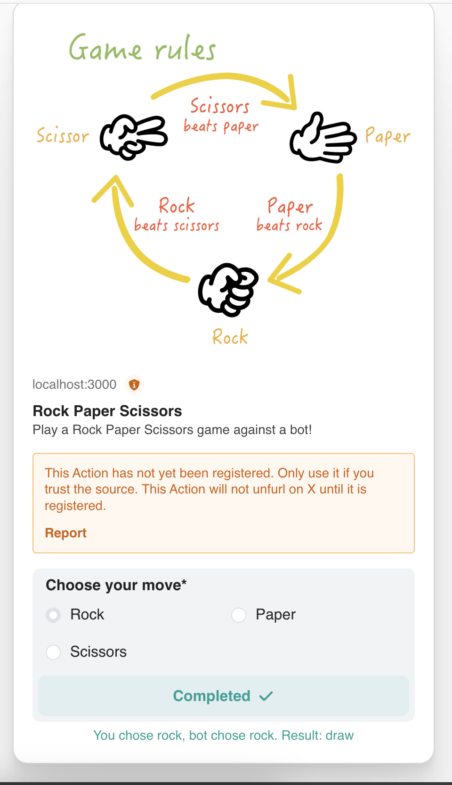

This is a Rock, Paper, Scissors game made as assignment for Catoff

## Getting Started

First, run the development server:

```bash
npm run dev
# or
yarn dev
# or
pnpm dev
# or
bun dev
```

Open [https://dial.to/developer?url=http%3A%2F%2Flocalhost%3A3000%2Fapi%2Factions%2Fmemo&cluster=devnet](https://dial.to/developer?url=http%3A%2F%2Flocalhost%3A3000%2Fapi%2Factions%2Fmemo&cluster=devnet) with your browser to play against a bot!

## How to Play
```bash
- Choose Your Move: Select Rock, Paper, or Scissors from the options provided.
- Play Against the Bot: The bot will make its move automatically.
- View the Results: See if you win, lose, or draw based on traditional game rules.
- Blockchain Interaction: Transactions are processed on the Solana devnet, powered via our favourite Blinks!
```
