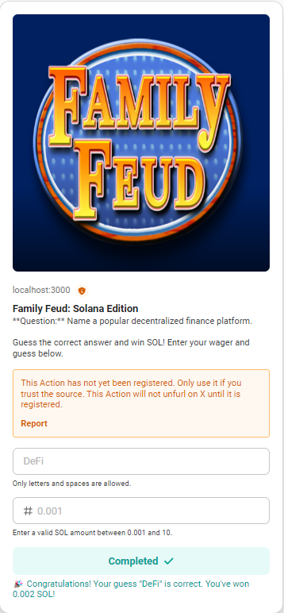

## This is a Family Feud Assignment for Catoff
## The user is currently not rewarded tokens on win, as that would require implementing partial signing with private keys, and difficult to reproduce from demo end

## Getting Started

First, run the development server:

```bash
npm run dev
# or
yarn dev
# or
pnpm dev
# or
bun dev
```

Open [https://dial.to/developer?url=http%3A%2F%2Flocalhost%3A3000%2Fapi%2Factions%2Fmemo&cluster=devnet](https://dial.to/developer?url=http%3A%2F%2Flocalhost%3A3000%2Fapi%2Factions%2Fmemo&cluster=devnet) with your browser to play against a bot!

## How to Play
```bash
- Choose Your Wager: Bet the amount that you know the answer
- Answer the question: Answer correctly for a surprise!
- View the Results: See if you win or lose.
- Blockchain Interaction: Transactions are processed on the Solana devnet, powered via our favourite Blinks!
```
